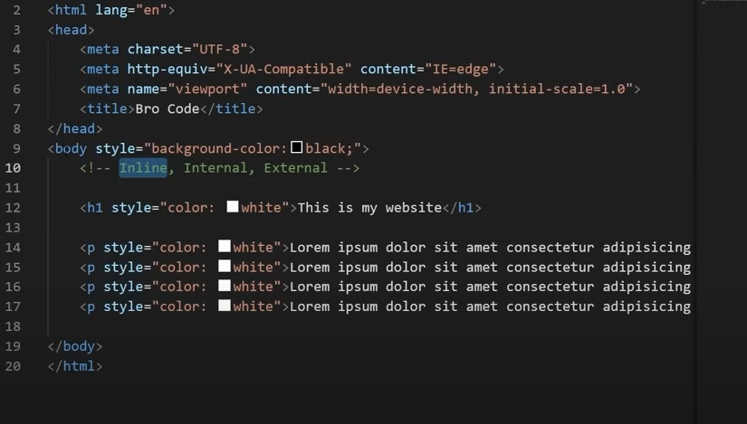

CSS is an acronym for Cascading Style Sheets.
We can apply CSS properties to color style and decorate html markup
There are 3 different ways to apply CSS:
1. Inline
2. Internal
3. External

### Inline CSS

